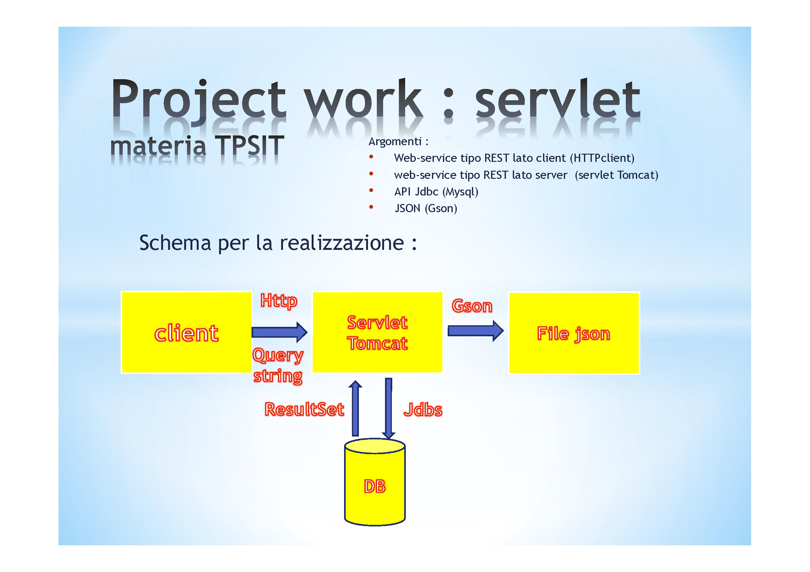

# Ville Venete
## Struttura progetto

## IDE e applicativi
- progetto creato con JetBrains IntelliJ IDEA Ultimate, garantito il funzionamento solo su questo IDE
- necessario Tomcat 11, occorre patchare XAMPP

## Creazione database
Creare un dabatase `villevenete` ed importare il file `src/villevenete.sql` nel database

## XAMPP patch

Ringrazio Barban per avermo fornito queste informazioni

1. scaricare tomcat 11 [qui](https://dlcdn.apache.org/tomcat/tomcat-11/v11.0.2/bin/apache-tomcat-11.0.2-windows-x64.zip)
2. estrarre il contenuto nella cartella `C:\xampp\tomcat` sovrascrivendo tutto ciò che è già esistente all'interno della cartella
3. aprire il file `C:\xampp\xampp-control.ini` e andare alla sezione `[BinaryNames]` modificare `Tomcat=tomcat8.exe` in `Tomcat=tomcat11.exe` (creare il file e la sezione nel caso non siano presenti)
